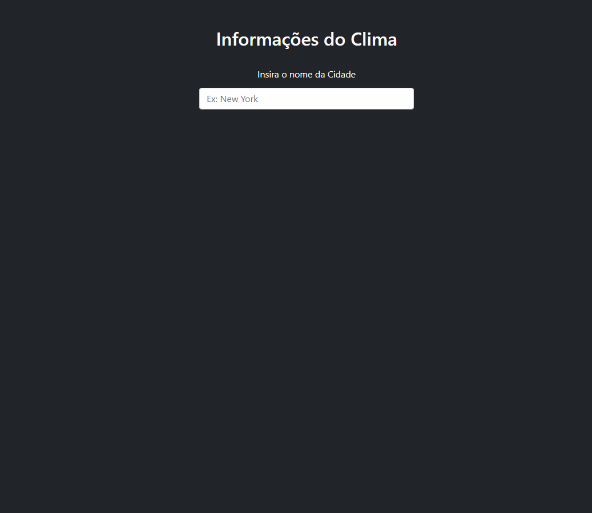

<h1 align="center">
  
  <p>Weather Application</p>
</h1>

<h1 align="center">
  
</h1>

<h3 align="center">
  <a href="https://weather-application-brown.vercel.app/">Acessar demonstração</a>
</h3>

---

## 📝 Sobre 

O projeto **Weather Applicatioin** é uma aplicação com JavaScript puro desenvolvido dentro do curso **CJRM** com o intuito de colocarmos em prática  os conteúdo aprendido.

---

## 🚀 Tecnologias utilizadas

Nesta aplicação foram utilizadas:

- JavaScript
  - Fetch API
  - DOM
- [Bootstrap](https://getbootstrap.com/)

---

## 📂 Como baixar o projeto

Para rodar o projeto em sua máquina, utileze a extensão no [vsCode](https://code.visualstudio.com/) [Live Server](https://marketplace.visualstudio.com/items?itemName=ritwickdey.LiveServer).

```bash
  # Clonar o repositório
  $ git clone  https://github.com/henriquebazi/weather-application

  # Entrar no diretório
  $ cd weather-application
```
---

Desenvolvido por Henrique Bazi.
